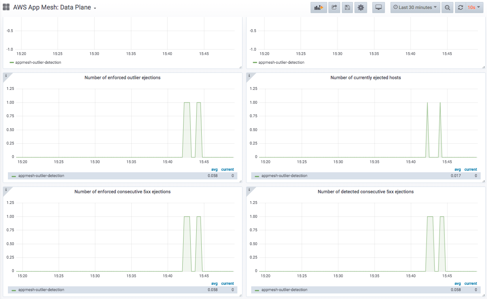

# kubecon-2020-aws-k8s-networking-appmesh
KubeCon North America 2020 / AWS container day / Kubernetes networking on AWS / AppMesh EKS demo

In this demo, we'll demonstrate the use of outlier detection in AWS App Mesh with EKS.

Outlier detection is a form of passive health check that temporarily ejects an endpoint/host of a given service (represented by a Virtual Node) from the load balancing set when it meets failure threshold (hence considered an outlier). Outlier detection is supported as configuration in Virtual Nodes listeners.

## Prerequisites
- EKS >=1.16
- Make sure to have `helm` [installed](https://helm.sh/docs/intro/install/).
- Make sure to have `jq` [installed](https://stedolan.github.io/jq/download/).
- Make sure to have newest [AWS CLI](https://aws.amazon.com/cli/) installed, that is, version `1.18.82` or above.
- Make sure to have `kubectl` [installed](https://kubernetes.io/docs/tasks/tools/install-kubectl/), at least version `1.15` or above.
- Install [App Mesh controller for Kubernetes](https://github.com/aws/eks-charts/tree/master/stable/appmesh-controller)
- Install [Prometheus](https://github.com/aws/eks-charts/tree/master/stable/appmesh-prometheus)
- Install [Grafana](https://github.com/aws/eks-charts/tree/master/stable/appmesh-grafana)
- Run the following to check the version of controller you are running.
```
kubectl get deployment -n appmesh-system appmesh-controller -o json | jq -r ".spec.template.spec.containers[].image" | cut -f2 -d ':'|tail -n1

v1.2.0
```

## Install mesh and sample application

Let's deploy the sample applications and mesh with outlier detection. This will deploy two Virtual Nodes (and applications): `front` and `colorapp`, where `front`->`colorapp` and `colorapp` is the backend with five replicas.

> You might need to set `VPC_ID` env as your cluster vpc id as this demo uses CloudMap service discovery

```
./deploy.sh
```

```
kubectl get virtualnode,pod,virtualgateway -n appmesh-outlier-detection
NAME                                   ARN                                                                                                                    AGE
virtualnode.appmesh.k8s.aws/colorapp   arn:aws:appmesh:us-west-2:669977933099:mesh/appmesh-outlier-detection/virtualNode/colorapp_appmesh-outlier-detection   141m
virtualnode.appmesh.k8s.aws/front      arn:aws:appmesh:us-west-2:669977933099:mesh/appmesh-outlier-detection/virtualNode/front_appmesh-outlier-detection      141m

NAME                            READY   STATUS    RESTARTS   AGE
pod/colorapp-5555976ff7-2h24r   2/2     Running   0          141m
pod/colorapp-5555976ff7-8jxjh   2/2     Running   0          141m
pod/colorapp-5555976ff7-ls4gf   2/2     Running   0          141m
pod/colorapp-5555976ff7-pgh2j   2/2     Running   0          141m
pod/colorapp-5555976ff7-wn79d   2/2     Running   0          141m
pod/front-6d8679647d-vbwqr      2/2     Running   0          141m
pod/ingress-5889c7f4d6-h4k22    1/1     Running   0          141m

NAME                                     ARN                                                                                                                      AGE
virtualgateway.appmesh.k8s.aws/ingress   arn:aws:appmesh:us-west-2:669977933099:mesh/appmesh-outlier-detection/virtualGateway/ingress_appmesh-outlier-detection   141m
```

Outlier detection is configured on the `colorapp` listener:
```
kubectl describe virtualnode colorapp -n appmesh-outlier-detection

    Outlier Detection:
      Base Ejection Duration:
        Unit:   s
        Value:  5
      Interval:
        Unit:                s
        Value:               10
      Max Ejection Percent:  20
      Max Server Errors:     5
    Port Mapping:
      Port:      8080
      Protocol:  http
```

Let's check the outlier detection configuration in AWS App Mesh

```
aws appmesh describe-virtual-node --virtual-node-name colorapp_appmesh-outlier-detection --mesh-name appmesh-outlier-detection
{
    "virtualNode": {
        "status": {
            "status": "ACTIVE"
        },
        "meshName": "appmesh-outlier-detection",
        "virtualNodeName": "colorapp_appmesh-outlier-detection",
        "spec": {
            "serviceDiscovery": {
                "awsCloudMap": {
                    "namespaceName": "appmesh-outlier-detection.pvt.aws.local",
                    "serviceName": "colorapp"
                }
            },
            "listeners": [
                {
                    "outlierDetection": {
                        "maxServerErrors": 5,
                        "interval": {
                            "value": 10,
                            "unit": "s"
                        },
                        "baseEjectionDuration": {
                            "value": 5,
                            "unit": "s"
                        },
                        "maxEjectionPercent": 50
                    },
                    "portMapping": {
                        "protocol": "http",
                        "port": 8080
                    }
                }
            ],
            "backends": []
        },
        "metadata": {
            "uid": "71e3a18f-9b3d-40d9-b45b-282ec39b04de",
            "lastUpdatedAt": 1605650739.103,
            "arn": "arn:aws:appmesh:us-west-2:669977933099:mesh/appmesh-outlier-detection/virtualNode/colorapp_appmesh-outlier-detection",
            "version": 2,
            "resourceOwner": "669977933099",
            "createdAt": 1605647147.458,
            "meshOwner": "669977933099"
        }
    }
}
```

## Verify outlier detection

The front application is exposed via ingress and supports the following operations:
- /get - returns the color
- /stats - returns the statistics of the color backends
- /reset_stats - resets the stats counter
- /fault - injects faults into one of the backends so it returns 500 responses
- /recover - remove the fault from a backend

Set the gateway endpoint
```
GW_ENDPOINT=$(kubectl get svc ingress -n appmesh-outlier-detection --output jsonpath='{.status.loadBalancer.ingress[0].hostname}') ; echo $GW_ENDPOINT
```
Let's verify colorapp is responsive via front

```
curl -i $GW_ENDPOINT/color/get

HTTP/1.1 200 OK
date: Fri, 23 Oct 2020 15:58:45 GMT
content-length: 7
content-type: text/plain; charset=utf-8
x-envoy-upstream-service-time: 1
server: envoy

purple
```

Let's check stats
```
curl $GW_ENDPOINT/stats | jq .

  % Total    % Received % Xferd  Average Speed   Time    Time     Time  Current
                                 Dload  Upload   Total   Spent    Left  Speed
100   522  100   522    0     0   4795      0 --:--:-- --:--:-- --:--:--  4788
[
  {
    "HostUID": "bc52bd5d-5fa0-42a6-a772-bf7242cbed6d",
    "Counter": {
      "StatusOk": 42,
      "StatusError": 0,
      "Total": 42
    }
  },
  {
    "HostUID": "91e8d446-cffc-42af-88f8-45a701c8352f",
    "Counter": {
      "StatusOk": 42,
      "StatusError": 0,
      "Total": 42
    }
  },
  {
    "HostUID": "937069b8-396f-490e-857f-de1c4dd6fbab",
    "Counter": {
      "StatusOk": 41,
      "StatusError": 0,
      "Total": 41
    }
  },
  {
    "HostUID": "857fca61-7437-4548-8af1-19f7b3bf8b7e",
    "Counter": {
      "StatusOk": 41,
      "StatusError": 0,
      "Total": 41
    }
  },
  {
    "HostUID": "b1545d7f-cc85-4932-a9c2-f74c2e41ca3f",
    "Counter": {
      "StatusOk": 41,
      "StatusError": 0,
      "Total": 41
    }
  }
]

```

Generate traffic
```
echo "GET http://$GW_ENDPOINT/color/get" | vegeta attack -duration=4s | tee results.bin | vegeta report

Requests      [total, rate, throughput]         200, 50.25, 50.23
Duration      [total, attack, wait]             3.982s, 3.98s, 1.628ms
Latencies     [min, mean, 50, 90, 95, 99, max]  1.59ms, 2.043ms, 1.93ms, 2.29ms, 2.464ms, 5.555ms, 12.771ms
Bytes In      [total, mean]                     1400, 7.00
Bytes Out     [total, mean]                     0, 0.00
Success       [ratio]                           100.00%
Status Codes  [code:count]                      200:200
Error Set:

```
Notice the stats counter going up for all the backends and response should be all 200 responses

Now, let's inject fault into one of the backends

```
curl $GW_ENDPOINT/color/fault

host: `937069b8-396f-490e-857f-de1c4dd6fbab` will now respond with 500 on /get.
```

Host `937069b8-396f-490e-857f-de1c4dd6fbab` will respond with HTTP 500 response and we will see how App Mesh automatically detects the faulty host and ejects it based on the outlier detection configuration on the colorapp virtual node.

Let's generate traffic to verify the behavior

```
echo "GET http://$GW_ENDPOINT/color/get" | vegeta attack -duration=4s | tee results.bin | vegeta report

Requests      [total, rate, throughput]         200, 50.25, 48.50
Duration      [total, attack, wait]             4.02s, 3.98s, 40.272ms
Latencies     [min, mean, 50, 90, 95, 99, max]  37.398ms, 46.73ms, 41.706ms, 54.108ms, 85.579ms, 139.847ms, 150.649ms
Bytes In      [total, mean]                     1435, 7.17
Bytes Out     [total, mean]                     0, 0.00
Success       [ratio]                           97.50%
Status Codes  [code:count]                      200:195  500:5
Error Set:
500 Internal Server Error
```

Notice that there are 5 requests that returned HTTP 500 response in the `Status Codes` row. App Mesh should detect this and eject the host for 10s. For next 10s, you should see all requests return HTTP 200 responses as the faulty host will no longer be serving traffic.


```
curl $GW_ENDPOINT/stats | jq .


  % Total    % Received % Xferd  Average Speed   Time    Time     Time  Current
                                 Dload  Upload   Total   Spent    Left  Speed
100   522  100   522    0     0   5696      0 --:--:-- --:--:-- --:--:--  5736
[
  {
    "HostUID": "bc52bd5d-5fa0-42a6-a772-bf7242cbed6d",
    "Counter": {
      "StatusOk": 91,
      "StatusError": 0,
      "Total": 91
    }
  },
  {
    "HostUID": "91e8d446-cffc-42af-88f8-45a701c8352f",
    "Counter": {
      "StatusOk": 91,
      "StatusError": 0,
      "Total": 91
    }
  },
  {
    "HostUID": "937069b8-396f-490e-857f-de1c4dd6fbab",
    "Counter": {
      "StatusOk": 41,
      "StatusError": 5,
      "Total": 46
    }
  },
  {
    "HostUID": "857fca61-7437-4548-8af1-19f7b3bf8b7e",
    "Counter": {
      "StatusOk": 90,
      "StatusError": 0,
      "Total": 90
    }
  },
  {
    "HostUID": "b1545d7f-cc85-4932-a9c2-f74c2e41ca3f",
    "Counter": {
      "StatusOk": 89,
      "StatusError": 0,
      "Total": 89
    }
  }
]
```

Notice that host `937069b8-396f-490e-857f-de1c4dd6fbab` returned 5 errors and no traffic was sent to this host. All the traffic was distributed between the other four hosts.

If we send more traffic during the ejection duration, we will see that all the requests will return `HTTP 200` responses since only the healthy hosts will be serving traffic:

```
echo "GET http://$GW_ENDPOINT/color/get" | vegeta attack -duration=4s | tee results.bin | vegeta report
Requests      [total, rate, throughput]         200, 50.28, 49.77
Duration      [total, attack, wait]             4.019s, 3.978s, 40.817ms
Latencies     [min, mean, 50, 90, 95, 99, max]  37.014ms, 46.102ms, 41.849ms, 53.49ms, 63.638ms, 129.34ms, 173.692ms
Bytes In      [total, mean]                     1400, 7.00
Bytes Out     [total, mean]                     0, 0.00
Success       [ratio]                           100.00%
Status Codes  [code:count]                      200:200
Error Set:
```

The request above was made while the host `937069b8-396f-490e-857f-de1c4dd6fbab` was ejected and we got 100% successful responses.

## Check Grafana
For the demo, you may use port-forwarding to the Grafana endpoint:
```
kubectl -n appmesh-system port-forward svc/appmesh-grafana 3000:3000
```



